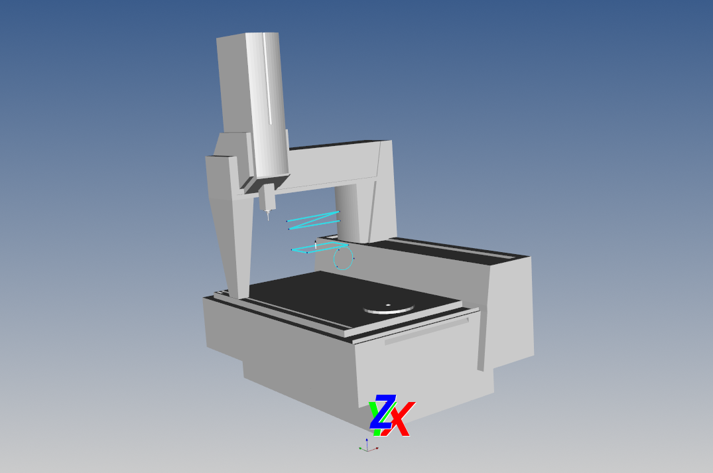

# Navigator

Este é um projeto do comportamento geométrico da operação de Medição por Coordenadas Zeiss Prismo Navigator, desconsiderando fatores de influência externas. Com a implementação funções algébricas e geométricas para reproduzir funções de manipulação de elementos presente no Software Calypso, o projeto é capaz de reproduzir o comportamento do equipamento em alto nível de abstração.

Projeto oriundo da união entre curiosidade em entender essas máquinas e o tempo livre entre 00:00 e 06:00 :heart_eyes:

> Uma versão digital da Máquina de Medição por Coordenadas Zeiss Prismo Navigator com uma pitadinha de computação gráfica :heart:

Neste ponto do projeto:

- [x] Modelos .STL da máquina
- [x] Movimentos de translação por inputs do teclado
- [x] Movimentos de translação por CNC
- [x] Criação de objetos geométricos no espaço
- [x] Reproduzir o código de cores do Zeiss Calypso :kissing_heart:
- [ ] Criação de sub-sistemas de coordenadas
- [ ] Detecção de intersecção entre objetos na cena (também conhecido como "Apalpar e medir" hahaha)
- [ ] Implementar ajuste por mínimos quadrados para Linhas
- [ ] Implementar ajuste por mínimos quadrados para Planos

## :eyes: Veja no YouTube! :eyes:

> Se inscreve no canal pois as atualizações do projeto aparecem por lá :yum::yum:

## 💻 Pré-requisitos

Antes de começar, verifique se você atendeu aos seguintes requisitos:

- Você instalou a versão mais recente da biblioteca `<vtk / Python 3.11 ou acima>`
- Você possui um computador com uma placa de vídeo com ao menos 2 Gb de VRAM

Atenção! O projeto foi desenvolvido em um computador com as seguintes especificações:
- Processador Ryzen 5 8500G 6 x 12 3551 MHz
- 8 Gb RAM DDR5
- MoBo MSI A620M-E
- Win 11 Pro v10.0.22631 Comp 22631

## 🚀 Instalando Navigator

Para instalar o Navigator, siga estas etapas:

- Baixe os 4 arquivos em formato .STL
- Baixe o arquivo Navigator.py e deixe-o no mesmo diretório dos arquivos .STL
- Execute o código!

## ☕ Usando Navigator

Utilize estes comandos do teclado para utilizar Navigator:

- Use "8" para executar uma demonstração da criação de elementos geométricos em modo CNC
- Use as setas para se movimentar no espaço
- Use "0" para listar a posição atual do centro do Sensor de apalpação no sistema de coordenadas da máquina e no sistema de coordenadas global
- Use "1" para registrar as coordenadas de um Ponto no espaço
- Use "2" para criar uma Linha usando os dois últimos pontos registrados
- Use "4" para criar um Círculo e então Navigator executará a trajetória deste objeto em modo CNC
- Use "6" para calcular o ângulo interno e externo entre duas linhas coplanares usando os últimos 4 pontos registrados
- Use "7" para criar um Plano usando os três últimos pontos registrados
- Use "9" para executar o programa de warm-up em modo CNC, inspirado no comando Shift + Return + F10 das MMCs Zeiss 
