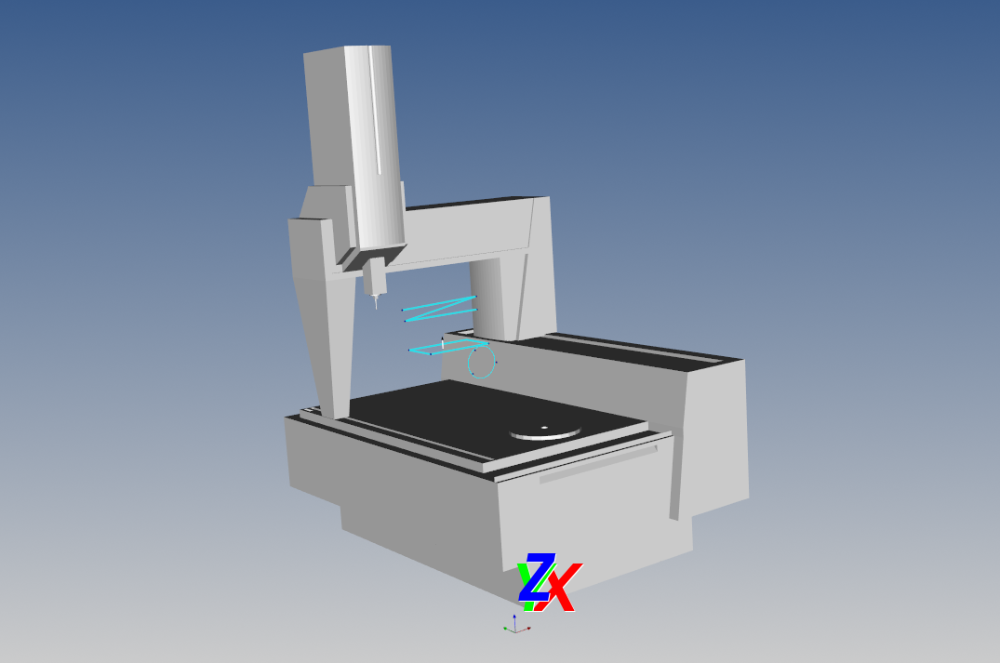
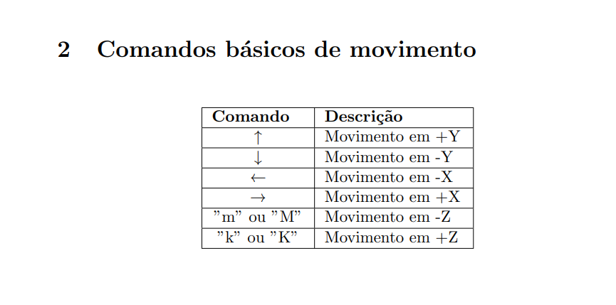
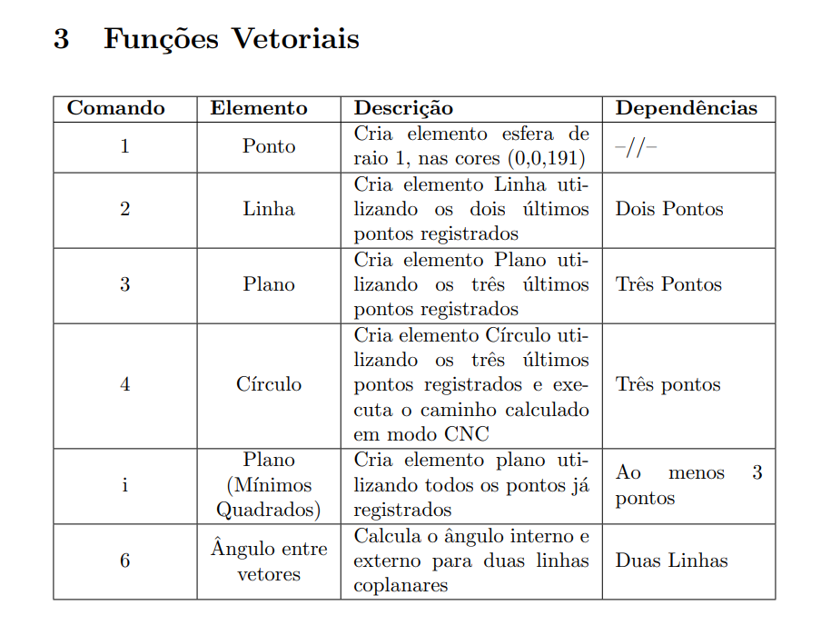
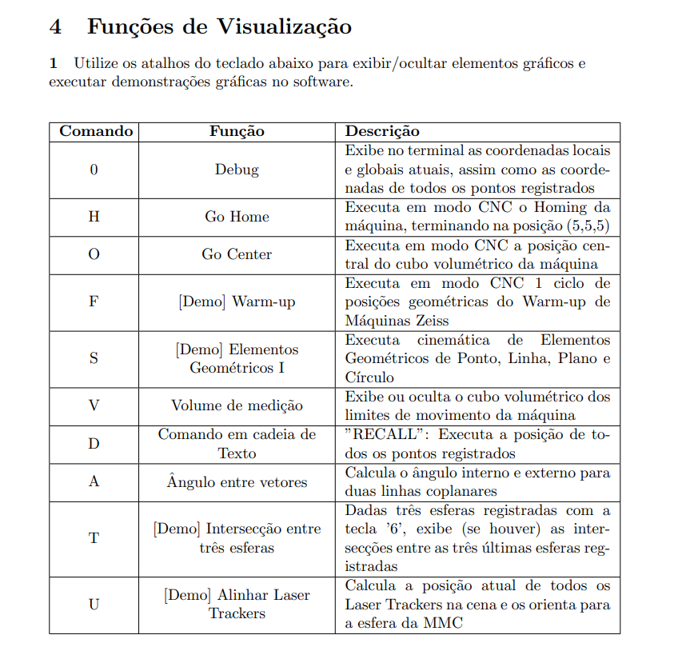

# Navigator

Este é um projeto do comportamento geométrico da operação de uma Máquina Medição por Coordenadas Zeiss Prismo Navigator, desconsiderando fatores de influência externas. Com a implementação funções algébricas e geométricas para reproduzir funções de manipulação de elementos presente no Software Calypso, o projeto é capaz de reproduzir o comportamento do equipamento em alto nível de abstração.

Projeto oriundo da união entre curiosidade em entender essas máquinas e o tempo livre entre 00:00 e 06:00 :heart_eyes:

> Uma versão digital da Máquina de Medição por Coordenadas Zeiss Prismo Navigator com uma pitadinha de computação gráfica :heart:

Neste ponto do projeto:

- [x] Modelos .STL da máquina
- [x] Movimentos de translação por inputs do teclado
- [x] Movimentos de translação por CNC
- [x] Criação de objetos geométricos no espaço
- [x] Reproduzir o código de cores do Zeiss Calypso :kissing_heart:
- [x] Emular algoritmos de medição: Trilateração
- [x] Criação de sub-sistemas de coordenadas
- [ ] Detecção de intersecção entre objetos na cena (também conhecido como "Apalpar e medir" hahaha)
- [ ] Implementar ajuste por mínimos quadrados para Linhas
- [x] Implementar ajuste por mínimos quadrados para Planos
- [x] Implementar ajuste por mínimos quadrados para Esferas

## :eyes: Veja no YouTube! :eyes:

> Se inscreve no canal pois as atualizações do projeto aparecem por lá :yum::yum:

## 💻 Pré-requisitos

Antes de começar, verifique se você atendeu aos seguintes requisitos:

- Você instalou a versão mais recente da biblioteca `<vtk / Python 3.11 ou acima>`
- Você possui um computador com uma placa de vídeo com ao menos 2 Gb de VRAM

Atenção! O projeto foi desenvolvido em um computador com as seguintes especificações:
- Processador Ryzen 5 8500G 6 x 12 3551 MHz
- 8 Gb RAM DDR5
- MoBo MSI A620M-E
- Win 11 Pro v10.0.22631 Comp 22631

## 💻 Instalando Navigator

Para instalar o Navigator, siga estas etapas:

- Baixe os 5 arquivos em formato .STL
- Baixe o arquivo Navigator.py e deixe-o no mesmo diretório dos arquivos .STL
- Execute o código!

## Usando Navigator

Consulte o arquivo "manual navigator.sty" para visualizar todos os comandos disponíveis. Abaixo estão os comandos simples para controle da máquina e criação de elementos geométricos

#### Referências:
- Engrenagem "SPUR D12 Z2 17 AP20" obtida de: https://khkgears2.net/catalog2/SS2-17
- Modelo .skp da Zeiss Prismo Navigator: [https://3dwarehouse-classic.sketchup.com/model/121100ae-13aa-4d65-8948-68686ba049c9/CMM-Carl-Zeiss-Prismo-Navigator](https://3dwarehouse.sketchup.com/model/121100ae-13aa-4d65-8948-68686ba049c9/CMM-Carl-Zeiss-Prismo-Navigator)
- Modelo .stl do Leica AT960: [https://grabcad.com/library/leica-at960-laser-tracker-1](https://grabcad.com/library/leica-at960-laser-tracker-1)
- Modelo .stl do KUKA KR10 R1100 [https://grabcad.com/library/kr10_r1100-robot-1](https://grabcad.com/library/kr10_r1100-robot-1)
